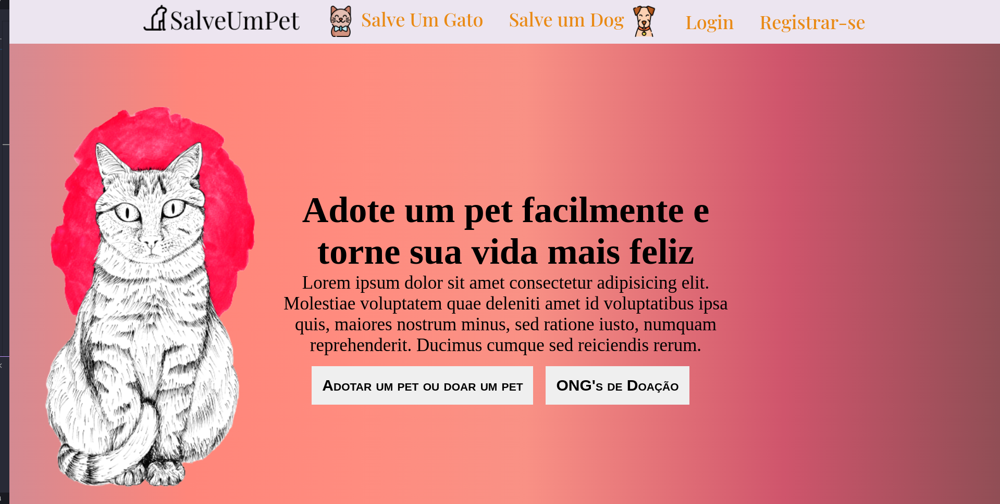
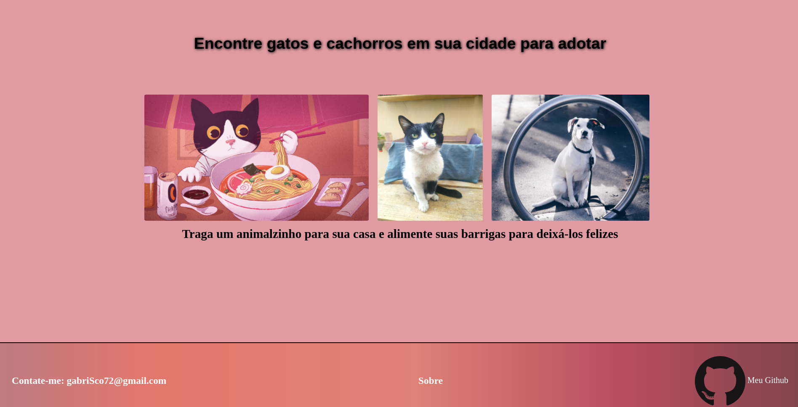
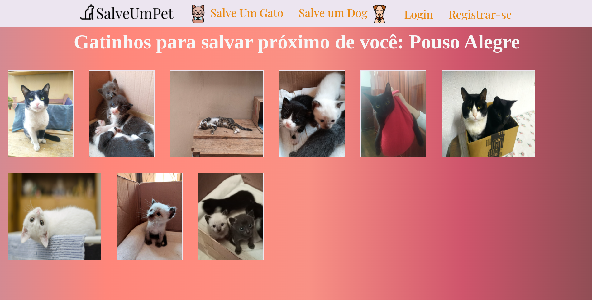
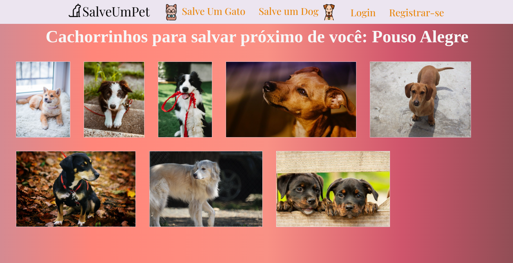
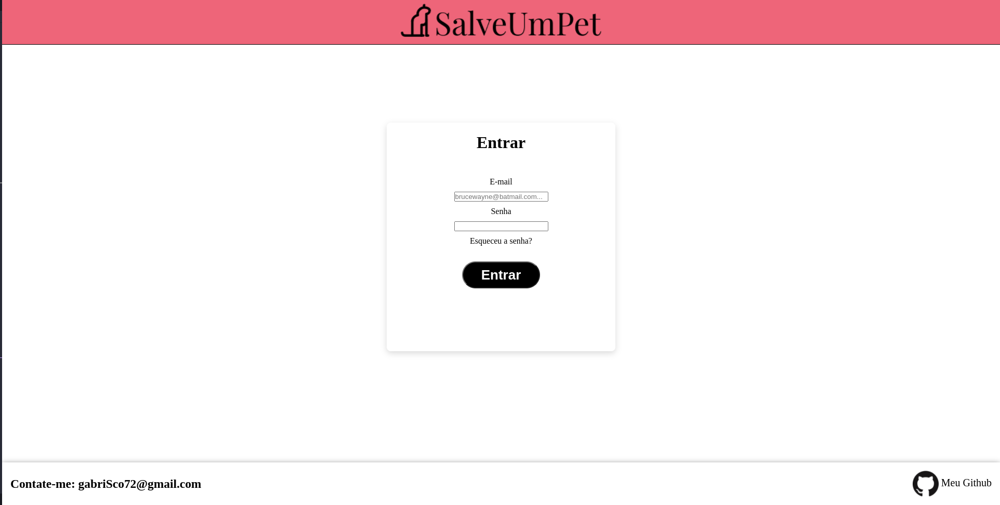

<h1>Salve Um Pet</h1>

Este site está em desenvolvimento é tem como objetivo facilitar a adoção de gatos e cachorros por meio de localizar animais que estão próximos e mais faceis de serem adotados.

O usuário poderá criar uma conta, e assim adotar ou doar um animalzinho.

Além disso, ONG's de doação poderão se cadastrar na plataforma para facilitar a divulgação para as pessoas

<h2>Página Inicial<h2>
  

<h2>Gatos para adoção<h2>

<h2>Cachorros para adoção<h2>

  
<h2>Página de Login<h2>

   
  

Estou aberto para sugestões

Contato: gabriSc72@gmail.com

