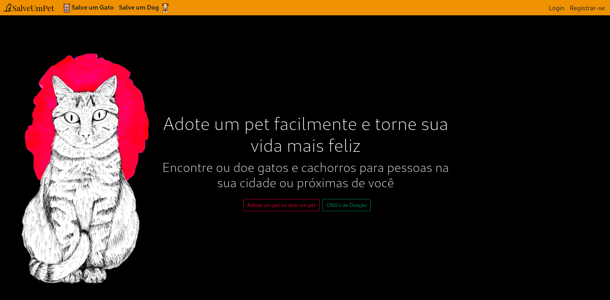
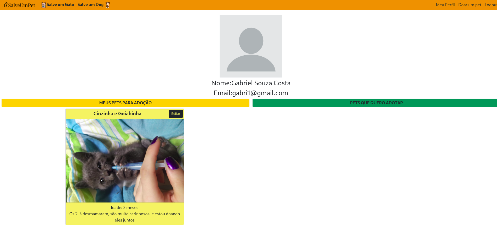
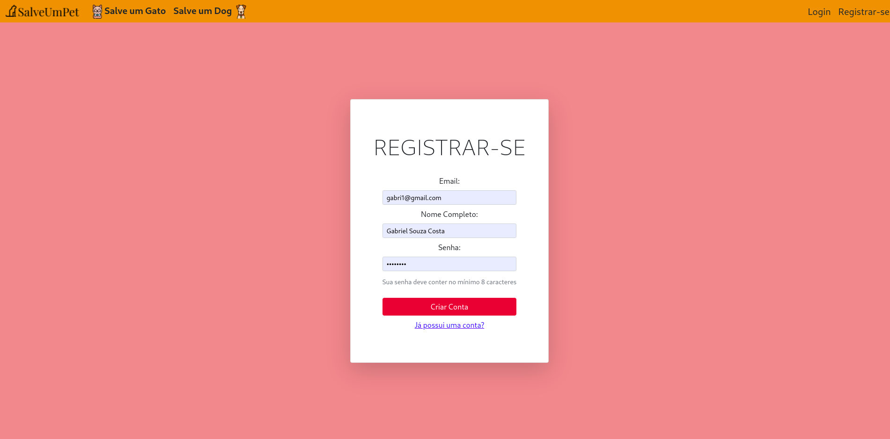

<h1>Salve Um Pet</h1>

Tecnologias usadas: Flask(como api) | React JS | Bootstrap 5 

O site está hospedado no Heroku no seguinte link: https://salveumpet-react.herokuapp.com/ </a>

Este site tem como objetivo facilitar a adoção de gatos e cachorros por meio de localizar animais que estão próximos e mais faceis de serem adotados.

O usuário poderá criar uma conta, e assim adotar ou doar um animalzinho.

<h2>Página Inicial<h2>
  

<h2>Perfil</h2>

<h2>Página de Registro<h2>

